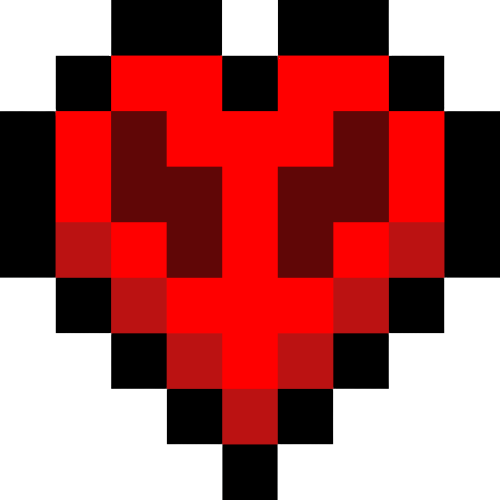

<!doctype html>
<html>
<head>
	<meta charset="utf-8" />
	<meta name="viewport" content="width=device-width, initial-scale=1">
	<link type="text/css" rel="stylesheet" href="style.css" />
	<title>unubua</title>
</head>
<body>
	

		<h2>Hola, mi linda!</h2>
		
Espero que en una fecha tan especial como la de hoy, puedas sentirte orgullosa de todo lo que ha transcurrido en 365(+) días.

		
Eres el amor de mi vida. Siempre nos vamos a amar e, igualmente como me lo dijiste, voy a sentirme orgulloso de la persona en la que te has convertido.

		
Recuerda: bebita ama a bebito, y bebito ama a bebita.

		<strong>Te amo.</strong>
		 
		
		
		
	

</body>
</html>
